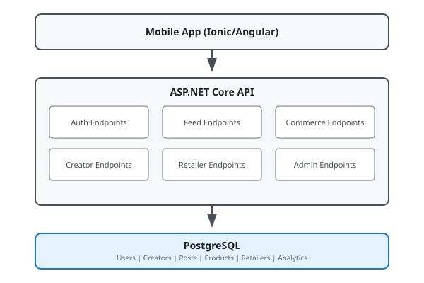

# LYKE Documentation

LYKE is a fashion social mobile application that helps shoppers view outfit content from people with similar body profiles. The app reduces purchase uncertainty and multi-size ordering/returns while providing insights to retailers.

## User Roles

LYKE supports four distinct user roles, each with specific workflows and capabilities:

| Role | Description |
|------|-------------|
| [Shopper](./user-workflows/shopper.md) | End consumers discovering and engaging with outfit content |
| [Creator](./user-workflows/creator.md) | Content creators uploading outfit posts and earning revenue |
| [Retailer](./user-workflows/retailer.md) | B2B partners managing products and advertising campaigns |
| [Admin](./user-workflows/admin.md) | Platform moderators and operators |

## Quick Links

- [Authentication](./authentication.md) - Login, registration, and account management
- [Affiliate Integration](./affiliate-integration.md) - How LYKE earns revenue through retailer affiliate programmes
- [API Reference](./api-reference.md) - Complete API endpoint documentation
- [Privacy & GDPR](./privacy.md) - Data protection and privacy policies

## Architecture Overview

## Key Concepts

### Body Profile Matching
LYKE's core value proposition is showing shoppers outfit content from people with similar body measurements. Body profiles include:
- Height (in cm)
- Weight (in kg)
- Body type (8 predefined types)
- Fit preference (Fitted, Regular, Relaxed)

### Privacy by Design
- Body profile data is **never** shared directly with retailers
- All retailer insights are aggregated and anonymized
- Profile displays show ranges/bands, not exact measurements
- GDPR-compliant with full account deletion support

### Content Workflow
All creator content goes through a moderation workflow before being published: **Draft → Pending Review → Published** (or Rejected)

### Commerce Attribution
LYKE tracks product clicks from posts and attributes conversions back to creators for affiliate earnings.
