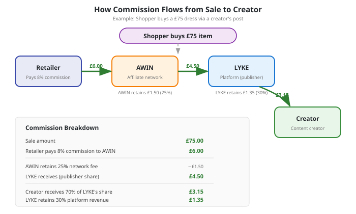
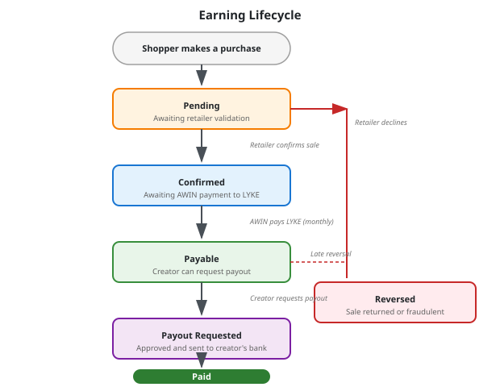
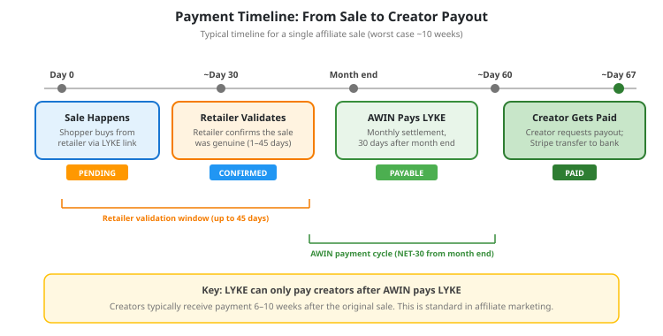

# Affiliate Network Integration

This document explains how LYKE connects to retailers through an affiliate network to generate revenue from product recommendations made by creators.

---

## What Is an Affiliate Network?

An affiliate network is a trusted financial intermediary that sits between retailers and platforms like LYKE. It handles all of the commercial complexity of tracking sales, calculating commissions, and moving money — so LYKE never needs to invoice retailers or build its own billing infrastructure.

When a LYKE user taps a product link in a creator's post and goes on to buy that product, the affiliate network:

1. **Tracks the sale** back to the original click in LYKE
2. **Calculates the commission** owed, based on the retailer's agreed rates
3. **Validates the transaction** (confirming the order wasn't returned or fraudulent)
4. **Pays LYKE** the commission on a monthly schedule

LYKE then shares a portion of that commission with the creator who posted the outfit.

---

## Why AWIN?

LYKE uses **AWIN** (formerly Affiliate Window) as its affiliate network. AWIN was chosen because:

- **UK fashion depth** — AWIN hosts the affiliate programmes of most major UK fashion retailers including ASOS, M&S, Reiss, Phase Eight, White Stuff, Jigsaw, and many others. A single AWIN account gives LYKE access to all of them.
- **Established and trusted** — AWIN is one of the largest affiliate networks globally, processing billions in transactions each year.
- **No upfront cost** — registering as a publisher (LYKE's role) is free. AWIN earns its fee as a percentage of each commission.

Other networks such as Rakuten Advertising, Impact, and Partnerize may be added in future to reach retailers not available on AWIN.

---

## How the Money Flows

When a shopper discovers an outfit on LYKE and buys a product from the retailer, a commission is generated and split between four parties.

### The Commission Split

Using a typical example of a £75 sale with an 8% retailer commission rate:

| Party | What they receive | How it's calculated |
|-------|------------------|-------------------|
| **Retailer** | The sale (£75) minus commission (£6) = **£69** | Retailer sets the commission rate (typically 5–15% for fashion) |
| **AWIN** | **£1.50** | 25% of the gross commission as a network fee |
| **LYKE** | **£1.35** | 30% of what AWIN pays LYKE (the platform's revenue) |
| **Creator** | **£3.15** | 70% of what AWIN pays LYKE (the creator's earnings) |

**LYKE's effective revenue per sale = 1.8% of the sale value.** This is small per transaction but scales with volume — thousands of shoppers making purchases through creator content generates meaningful revenue.

The 70/30 split between creators and LYKE is a platform-level setting. Creators always receive the majority share as an incentive to produce high-quality content.

---

## The Shopper Experience

From the shopper's perspective, the affiliate integration is invisible:

1. **Browse** — The shopper scrolls through outfit posts from creators with a similar body profile
2. **Tap** — They tap a product they like (e.g., "River Island Midi Dress — £45")
3. **Redirect** — The app opens the retailer's product page in a browser
4. **Buy** — The shopper completes the purchase on the retailer's own website

The only difference from visiting the retailer directly is that LYKE's tracking link is used in step 3, which allows the affiliate network to attribute the sale back to LYKE and the specific creator's post.

---

## How Creators Earn Money

Creators earn commission whenever a shopper buys a product they've featured in a post. The earning goes through several stages before reaching the creator's bank account.

### Stage 1: Pending

The shopper has made a purchase, and the sale has been recorded. However, the retailer hasn't yet confirmed it — the order could still be returned, cancelled, or flagged as fraudulent. During this stage, the earning appears in the creator's dashboard as "Pending" with an estimated confirmation date.

### Stage 2: Confirmed

The retailer has validated the sale through the affiliate network. The commission amount is now locked in. However, LYKE hasn't received the money yet — AWIN pays publishers on a monthly cycle with a 30-day delay.

### Stage 3: Payable

AWIN has paid LYKE for this transaction. The money is now in LYKE's account and the creator's earning is available for withdrawal. The creator can request a payout at any time once their payable balance meets the minimum threshold (£50).

### Stage 4: Paid

The creator has requested a payout, it has been approved, and the funds have been transferred to their bank account via Stripe.

### Reversed

At any point before payment, AWIN may notify LYKE that a transaction has been declined — typically because the shopper returned the item. Reversed earnings are removed from the creator's balance. If a reversal happens after the creator has already been paid, a small deduction is applied to their next payout (see "What Happens When a Sale Is Returned" below).

---

## Payment Timeline

The most important thing to understand about affiliate payments is the delay between a sale happening and the creator receiving money. This is standard across the affiliate marketing industry and is driven by two factors:

1. **Retailer validation** — Retailers need time (typically 2–6 weeks) to confirm that sales are genuine and haven't been returned
2. **Network payment cycle** — AWIN pays publishers monthly, approximately 30 days after the end of the month in which transactions were confirmed

### Worked Example

| Event | Approximate date |
|-------|-----------------|
| Shopper buys a dress via a creator's LYKE post | 15 January |
| Retailer confirms the sale (no return) | ~10 February |
| AWIN closes January/February billing cycle | 28 February |
| AWIN pays LYKE (NET-30 from month end) | ~30 March |
| Creator requests and receives payout | Early April |

**Total time from sale to creator payment: approximately 10–11 weeks.**

In the best case (sale confirmed quickly, AWIN payment lands promptly), this can be as short as 6 weeks. The LYKE creator dashboard shows an estimated payment date for each pending earning so creators know what to expect.

---

## How Creators Get Paid

Once a creator has payable earnings, they can withdraw money through LYKE's payout system.

### Setting Up Payouts

Before receiving their first payment, creators must:

1. **Be verified** — complete LYKE's creator verification process
2. **Connect a bank account** — LYKE uses Stripe Connect for payments. The creator taps "Set up payouts" in the app, which opens Stripe's secure onboarding flow. Stripe handles all identity verification and bank account collection — LYKE never sees or stores the creator's banking details.

### Requesting a Payout

Once set up, creators can request a payout at any time from their earnings page. The process:

1. Creator taps "Request payout" (available when payable balance is £50 or more)
2. All available earnings are bundled into a single payout request
3. Small payouts (under £200) are approved automatically; larger amounts are reviewed by the LYKE team first
4. Funds are transferred directly to the creator's bank account, typically within 2–3 business days

### Creator Balance Display

The earnings page shows three distinct balances:

| Balance | Meaning |
|---------|---------|
| **Pending** | Sales recorded but not yet confirmed by the retailer — these may still be reversed |
| **Confirmed** | Sales confirmed by the retailer but LYKE hasn't received the money from AWIN yet |
| **Available for payout** | Money LYKE has received from AWIN — the creator can withdraw this now |

This transparency helps creators understand why there is a delay between a sale appearing and being available for withdrawal.

---

## What Happens When a Sale Is Returned

Fashion has high return rates (30–40% is common). When a shopper returns a product that generated a creator earning:

### If the earning hasn't been paid yet

The earning is simply reversed — it disappears from the creator's balance. No money was exchanged, so no recovery is needed.

### If the earning has already been paid to the creator

LYKE uses a tiered approach:

| Reversal amount | What happens |
|----------------|-------------|
| **£10 or less** | LYKE absorbs the loss as a cost of doing business. The creator is not affected. |
| **More than £10** | A deduction is applied to the creator's next payout. The creator is notified with a clear explanation (e.g., "A previous sale of £25 was returned by the customer. £17.50 has been deducted from your balance.") |

This approach balances fairness to creators (small returns don't create administrative burden) with financial sustainability for LYKE (larger returns are recovered).

---

## Retailer Onboarding

Adding a new retailer to LYKE's affiliate programme involves both commercial and technical steps.

### Step 1: Find the Retailer on AWIN

Most UK fashion retailers already have an affiliate programme on AWIN. LYKE searches AWIN's marketplace for the retailer and reviews their commission rates and terms.

### Step 2: Apply to the Programme

LYKE submits an application to the retailer's affiliate programme through AWIN. This typically includes a brief description of how LYKE drives traffic (body-profile matched outfit recommendations in a mobile app). Approval usually takes a few days to a few weeks depending on the retailer.

### Step 3: Configure in LYKE

Once approved, LYKE's admin team adds the retailer's details to the platform — the AWIN merchant identifier, commission rate, and product feed configuration. No code changes are required to add a new retailer; it's a configuration update.

### Step 4: Creators Start Tagging Products

Once the retailer is configured, creators can tag products from that retailer in their outfit posts. Product links automatically route through AWIN's tracking system to enable commission attribution.

---

## Reconciliation and Accuracy

LYKE runs a daily reconciliation process against AWIN's records to ensure accuracy:

- **Every transaction** in LYKE is cross-checked against AWIN's transaction records
- **Status mismatches** (e.g., LYKE thinks a sale is pending but AWIN has confirmed or declined it) are corrected automatically
- **Missing transactions** (recorded by AWIN but not by LYKE) are flagged for investigation

This ensures that creator earnings are always accurate and that LYKE's financial records match what AWIN reports.

---

## Sponsored Placements

In addition to affiliate commissions, LYKE supports **sponsored placements** — retailers can pay to promote specific products within the app. These work differently from affiliate earnings:

- **Paid directly by the retailer to LYKE** (not through AWIN)
- **No dependency on shopper purchases** — the retailer pays for visibility, not conversions
- **Immediate payment to creators** — since LYKE receives the money directly, sponsored earnings don't go through the AWIN payment cycle and can be paid to creators much faster
- **Higher margin for LYKE** — sponsored revenue bypasses the AWIN/creator commission split

Sponsored placements are a planned revenue stream for later phases and are not yet active.

---

## Revenue Summary

LYKE has three potential revenue streams from retailer relationships:

| Revenue Stream | How it works | Status |
|---------------|-------------|--------|
| **Affiliate commissions** | LYKE earns 1.8% of every sale made through creator content | Active (via AWIN) |
| **Sponsored placements** | Retailers pay to promote products in the matched feed | Planned |
| **Retailer insight subscriptions** | Retailers pay for anonymised body profile and fit trend data | Planned |

Affiliate commissions are the foundation. As the platform grows, sponsored placements and data subscriptions provide additional revenue that is not dependent on individual shopper purchases.

---

## Key Terms

| Term | Definition |
|------|-----------|
| **Affiliate network** | A marketplace connecting retailers (advertisers) with platforms like LYKE (publishers) to track and pay commissions on referred sales |
| **AWIN** | The affiliate network LYKE uses, one of the largest globally with strong UK fashion coverage |
| **Publisher** | LYKE's role in the affiliate network — the platform that refers shoppers to retailers |
| **Advertiser** | The retailer's role in the affiliate network — the business that pays commissions on referred sales |
| **Commission** | The percentage of a sale that the retailer pays to the affiliate network for the referral |
| **Network override** | The percentage AWIN retains from each commission as its service fee (typically 25%) |
| **Attribution** | The process of connecting a shopper's purchase back to the specific creator post and click that led to it |
| **Validation window** | The period during which a retailer can confirm or decline a transaction (typically 2–6 weeks) |
| **NET-30** | Payment terms meaning the amount is paid 30 days after the billing period closes |
| **Clawback** | A deduction from a creator's future earnings to recover a commission that was reversed after payment |
