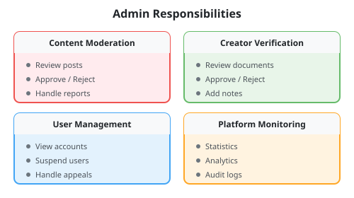
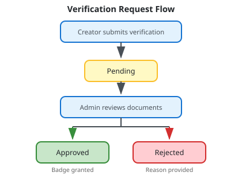
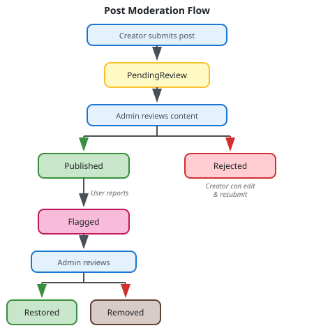

# Admin Workflows

Admins are platform operators responsible for content moderation, user management, creator verification, and platform monitoring.

## Overview



## Creator Verification

### Verification Request Flow



### List Pending Verifications

**Endpoint:** `GET /api/admin/v1/verifications`

**Authorization:** AdminOnly

**Query Parameters:**
| Parameter | Type | Description |
|-----------|------|-------------|
| `status` | string | Filter by status (Pending, Approved, Rejected) |
| `page` | int | Page number |
| `pageSize` | int | Items per page |

**Response:**

```json
{
  "success": true,
  "data": [
    {
      "creatorId": "creator-guid",
      "userId": "user-guid",
      "displayName": "StyleByJane",
      "email": "jane@example.com",
      "status": "Pending",
      "submittedAt": "2024-01-10T10:00:00Z",
      "documentCount": 2
    }
  ],
  "meta": {
    "page": 1,
    "pageSize": 20,
    "totalCount": 15
  }
}
```

### Get Verification Details

**Endpoint:** `GET /api/admin/v1/verifications/{creatorId}`

**Authorization:** AdminOnly

**Response:**

```json
{
  "success": true,
  "data": {
    "creatorId": "creator-guid",
    "userId": "user-guid",
    "displayName": "StyleByJane",
    "email": "jane@example.com",
    "bio": "Fashion enthusiast...",
    "socialLinks": {
      "instagram": "@stylebyjane",
      "tiktok": "@stylebyjane"
    },
    "status": "Pending",
    "documentUrls": [
      "https://storage.example.com/verification/doc1.jpg",
      "https://storage.example.com/verification/doc2.jpg"
    ],
    "submissionNotes": "Government ID and proof of social media account",
    "submittedAt": "2024-01-10T10:00:00Z",
    "previousAttempts": [
      {
        "status": "Rejected",
        "rejectionReason": "Documents unclear, please resubmit",
        "reviewedAt": "2024-01-05T14:00:00Z",
        "reviewedBy": "admin-name"
      }
    ]
  }
}
```

### Review Verification

**Endpoint:** `POST /api/admin/v1/verifications/{creatorId}/review`

**Authorization:** AdminOnly

**Approve:**

```json
{
  "decision": "Approved",
  "notes": "All documents verified successfully"
}
```

**Reject:**

```json
{
  "decision": "Rejected",
  "rejectionReason": "Social media account does not match submitted handle",
  "notes": "Instagram handle in documents shows @different_handle"
}
```

**Result:**

- Approved: Creator's `IsVerified` set to true, verified badge displayed
- Rejected: Creator notified with reason, can resubmit

## Content Moderation

### Post Moderation Flow



### List Posts for Moderation

**Endpoint:** `GET /api/admin/v1/posts`

**Authorization:** AdminOnly

**Query Parameters:**
| Parameter | Type | Description |
|-----------|------|-------------|
| `status` | string | Filter by status (PendingReview, Flagged) |
| `creatorId` | guid | Filter by creator |
| `page` | int | Page number |
| `pageSize` | int | Items per page |

**Response:**

```json
{
  "success": true,
  "data": [
    {
      "id": "post-guid",
      "title": "Summer Office Look",
      "status": "PendingReview",
      "creator": {
        "id": "creator-guid",
        "displayName": "StyleByJane",
        "isVerified": true
      },
      "mediaType": "Image",
      "thumbnailUrls": ["https://..."],
      "productCount": 3,
      "submittedAt": "2024-01-10T10:00:00Z",
      "reportCount": 0
    }
  ],
  "meta": {
    "page": 1,
    "pageSize": 20,
    "totalCount": 45
  }
}
```

### Get Post for Moderation

**Endpoint:** `GET /api/admin/v1/posts/{postId}`

**Authorization:** AdminOnly

**Response:**

```json
{
  "success": true,
  "data": {
    "id": "post-guid",
    "title": "Summer Office Look",
    "description": "Perfect outfit for those hot summer days...",
    "status": "PendingReview",
    "mediaType": "Image",
    "mediaUrls": ["https://..."],
    "thumbnailUrls": ["https://..."],
    "creator": {
      "id": "creator-guid",
      "displayName": "StyleByJane",
      "isVerified": true,
      "previousViolations": 0
    },
    "products": [
      {
        "id": "post-product-guid",
        "product": {
          "id": "product-guid",
          "name": "Floral Maxi Dress",
          "retailer": "Fashion Brand"
        },
        "sizeWorn": "M",
        "fitRating": "TrueToSize",
        "fitNotes": "Perfect fit at the waist",
        "fitTags": ["True to size"]
      }
    ],
    "submittedAt": "2024-01-10T10:00:00Z",
    "reports": [],
    "previousModeration": null
  }
}
```

### Moderate Post

**Endpoint:** `POST /api/admin/v1/posts/{postId}/moderate`

**Authorization:** AdminOnly

**Approve:**

```json
{
  "decision": "Approved",
  "notes": "Content meets guidelines"
}
```

**Reject:**

```json
{
  "decision": "Rejected",
  "notes": "Products not clearly visible in images. Please resubmit with clearer photos."
}
```

**Remove (for flagged posts):**

```json
{
  "decision": "Removed",
  "notes": "Confirmed violation of community guidelines"
}
```

**Result:**

- Approved: Status → `Published`, `PublishedAt` timestamp set
- Rejected: Status → `Rejected`, creator notified with notes
- Removed: Status → `Removed`, post hidden from all feeds

### Bulk Moderate Posts

**Endpoint:** `POST /api/admin/v1/posts/bulk-moderate`

**Authorization:** AdminOnly

```json
{
  "postIds": ["post-guid-1", "post-guid-2", "post-guid-3"],
  "decision": "Approved",
  "notes": "Batch approval - all meet guidelines"
}
```

## Content Reports

### List Reports

**Endpoint:** `GET /api/admin/v1/reports`

**Authorization:** AdminOnly

**Query Parameters:**
| Parameter | Type | Description |
|-----------|------|-------------|
| `status` | string | Filter by status (Pending, Reviewed) |
| `reason` | string | Filter by reason |
| `page` | int | Page number |
| `pageSize` | int | Items per page |

**Response:**

```json
{
  "success": true,
  "data": [
    {
      "id": "report-guid",
      "postId": "post-guid",
      "postTitle": "Questionable Content",
      "reporterId": "user-guid",
      "reason": "InappropriateContent",
      "additionalDetails": "The content appears to...",
      "status": "Pending",
      "createdAt": "2024-01-10T15:00:00Z"
    }
  ],
  "meta": {
    "page": 1,
    "pageSize": 20,
    "totalCount": 12
  }
}
```

**Report Reasons:**

- `InappropriateContent` - Offensive or adult content
- `MistaggedProducts` - Products don't match what's shown
- `Fraud` - Deceptive or scam content
- `Other` - Other violations

### Get Report Details

**Endpoint:** `GET /api/admin/v1/reports/{reportId}`

**Authorization:** AdminOnly

### Review Report

**Endpoint:** `POST /api/admin/v1/reports/{reportId}/review`

**Authorization:** AdminOnly

**Dismiss:**

```json
{
  "decision": "Dismissed",
  "notes": "Reviewed content, no violation found"
}
```

**Uphold:**

```json
{
  "decision": "Upheld",
  "notes": "Confirmed violation, post flagged for removal",
  "flagPost": true
}
```

**Result:**

- Dismissed: Report closed, post remains published
- Upheld with flagPost: Post status → `Flagged`, requires further action

## User Management

### List Users

**Endpoint:** `GET /api/admin/v1/users`

**Authorization:** AdminOnly

**Query Parameters:**
| Parameter | Type | Description |
|-----------|------|-------------|
| `userType` | string | Filter by type (Shopper, Creator, Retailer) |
| `status` | string | Filter by status (Active, Suspended) |
| `search` | string | Search by email or name |
| `page` | int | Page number |
| `pageSize` | int | Items per page |

**Response:**

```json
{
  "success": true,
  "data": [
    {
      "id": "user-guid",
      "email": "user@example.com",
      "userType": "Creator",
      "isActive": true,
      "isSuspended": false,
      "createdAt": "2024-01-01T00:00:00Z",
      "lastLoginAt": "2024-01-15T10:00:00Z",
      "creatorInfo": {
        "displayName": "StyleByJane",
        "isVerified": true,
        "postCount": 25
      }
    }
  ],
  "meta": {
    "page": 1,
    "pageSize": 20,
    "totalCount": 5420
  }
}
```

### Get User Details

**Endpoint:** `GET /api/admin/v1/users/{userId}`

**Authorization:** AdminOnly

**Response:**

```json
{
  "success": true,
  "data": {
    "id": "user-guid",
    "email": "user@example.com",
    "userType": "Creator",
    "isActive": true,
    "isSuspended": false,
    "suspensionHistory": [],
    "createdAt": "2024-01-01T00:00:00Z",
    "lastLoginAt": "2024-01-15T10:00:00Z",
    "hasBodyProfile": true,
    "creatorInfo": {
      "id": "creator-guid",
      "displayName": "StyleByJane",
      "isVerified": true,
      "verificationStatus": "Approved",
      "postCount": 25,
      "totalEarnings": 1250.5
    },
    "activitySummary": {
      "totalPosts": 25,
      "publishedPosts": 22,
      "totalEngagements": 15420,
      "reportsReceived": 1,
      "reportsSubmitted": 0
    }
  }
}
```

### Suspend User

**Endpoint:** `POST /api/admin/v1/users/{userId}/suspend`

**Authorization:** AdminOnly

```json
{
  "reason": "Multiple violations of community guidelines",
  "duration": "permanent"
}
```

**Duration Options:**

- `7d` - 7 days
- `30d` - 30 days
- `90d` - 90 days
- `permanent` - Permanent suspension

**Result:**

- User's `SuspendedAt` timestamp set
- User's `SuspensionReason` recorded
- User cannot log in
- For creators: All posts hidden from feeds

### Unsuspend User

**Endpoint:** `POST /api/admin/v1/users/{userId}/unsuspend`

**Authorization:** AdminOnly

```json
{
  "notes": "Appeal reviewed, suspension lifted"
}
```

### Bulk Suspend Users

**Endpoint:** `POST /api/admin/v1/users/bulk-suspend`

**Authorization:** AdminOnly

```json
{
  "userIds": ["user-guid-1", "user-guid-2"],
  "reason": "Coordinated spam activity",
  "duration": "permanent"
}
```

## Platform Monitoring

### Platform Statistics

**Endpoint:** `GET /api/admin/v1/stats`

**Authorization:** AdminOnly

**Response:**

```json
{
  "success": true,
  "data": {
    "users": {
      "total": 50000,
      "shoppers": 45000,
      "creators": 4500,
      "retailers": 450,
      "admins": 50,
      "activeToday": 8500,
      "newThisWeek": 1200
    },
    "content": {
      "totalPosts": 125000,
      "publishedPosts": 118000,
      "pendingReview": 450,
      "flaggedPosts": 25,
      "productsLinked": 85000
    },
    "commerce": {
      "totalClicks": 2500000,
      "conversions": 45000,
      "conversionRate": 1.8,
      "totalRevenue": 850000.0,
      "creatorEarnings": 68000.0
    },
    "moderation": {
      "pendingVerifications": 15,
      "pendingReports": 12,
      "recentSuspensions": 3
    }
  }
}
```

### Platform Analytics

**Endpoint:** `GET /api/admin/v1/analytics`

**Authorization:** AdminOnly

**Query Parameters:**
| Parameter | Type | Description |
|-----------|------|-------------|
| `startDate` | date | Start of date range |
| `endDate` | date | End of date range |
| `granularity` | string | daily, weekly, monthly |

**Response:**

```json
{
  "success": true,
  "data": {
    "dailyMetrics": [
      {
        "date": "2024-01-15",
        "activeUsers": 8500,
        "newUsers": 180,
        "postsPublished": 120,
        "engagements": 45000,
        "clicks": 8500,
        "conversions": 150,
        "revenue": 12500.0
      }
    ],
    "trends": {
      "userGrowth": 5.2,
      "engagementGrowth": 8.1,
      "revenueGrowth": 12.5
    }
  }
}
```

### Moderation Queue (Priority)

**Endpoint:** `GET /api/admin/v1/moderation-queue`

**Authorization:** AdminOnly

Returns prioritized items requiring attention:

**Response:**

```json
{
  "success": true,
  "data": {
    "highPriority": [
      {
        "type": "Report",
        "id": "report-guid",
        "description": "Multiple reports on same post",
        "urgency": "high",
        "createdAt": "2024-01-15T08:00:00Z"
      }
    ],
    "pendingVerifications": 15,
    "pendingPosts": 45,
    "pendingReports": 12,
    "flaggedContent": 25
  }
}
```

### Audit Logs

**Endpoint:** `GET /api/admin/v1/audit-logs`

**Authorization:** AdminOnly

**Query Parameters:**
| Parameter | Type | Description |
|-----------|------|-------------|
| `userId` | guid | Filter by acting user |
| `targetUserId` | guid | Filter by target user |
| `action` | string | Filter by action type |
| `entityType` | string | Filter by entity type |
| `startDate` | date | Start of date range |
| `endDate` | date | End of date range |
| `page` | int | Page number |
| `pageSize` | int | Items per page |

**Response:**

```json
{
  "success": true,
  "data": [
    {
      "id": "audit-guid",
      "userId": "admin-guid",
      "userName": "admin@lyke.com",
      "targetUserId": "user-guid",
      "targetUserName": "creator@example.com",
      "action": "UserSuspended",
      "entityType": "User",
      "entityId": "user-guid",
      "details": {
        "reason": "Violation of community guidelines",
        "duration": "permanent"
      },
      "ipAddress": "192.168.1.100",
      "timestamp": "2024-01-15T14:30:00Z"
    }
  ],
  "meta": {
    "page": 1,
    "pageSize": 50,
    "totalCount": 1250
  }
}
```

**Common Actions:**

- `UserSuspended`
- `UserUnsuspended`
- `PostApproved`
- `PostRejected`
- `PostRemoved`
- `VerificationApproved`
- `VerificationRejected`
- `ReportReviewed`

## Workflow Example: Daily Moderation Routine

1. **Check moderation queue:** `GET /api/admin/v1/moderation-queue` - Review high priority items and pending verifications

2. **Handle high priority reports first:**
   - `GET /api/admin/v1/reports/{id}`
   - `POST /api/admin/v1/reports/{id}/review` with decision

3. **Review flagged posts:**
   - `GET /api/admin/v1/posts?status=Flagged`
   - `POST /api/admin/v1/posts/{id}/moderate` with decision

4. **Process pending posts (batch):**
   - `GET /api/admin/v1/posts?status=PendingReview`
   - `POST /api/admin/v1/posts/bulk-moderate` for batch approval

5. **Review verification requests:**
   - `GET /api/admin/v1/verifications?status=Pending`
   - `POST /api/admin/v1/verifications/{id}/review` with decision

6. **Check platform health:** `GET /api/admin/v1/stats` - Monitor for anomalies

7. **Review audit logs:** `GET /api/admin/v1/audit-logs?startDate=today` - Maintain accountability

## Best Practices for Admins

### Content Moderation

1. **Consistency**: Apply guidelines uniformly across all content
2. **Documentation**: Always provide clear notes for rejections
3. **Timeliness**: Process queue regularly to maintain creator trust
4. **Escalation**: Flag unusual patterns for team review

### User Management

1. **Due process**: Review evidence before suspension
2. **Proportionality**: Match suspension severity to violation
3. **Communication**: Ensure reasons are clear and actionable
4. **Appeals**: Allow path for legitimate appeals

### Platform Monitoring

1. **Daily checks**: Review stats for anomalies
2. **Trend analysis**: Watch for concerning patterns
3. **Audit trail**: Maintain accountability through logs
4. **Incident response**: Escalate unusual activity quickly
