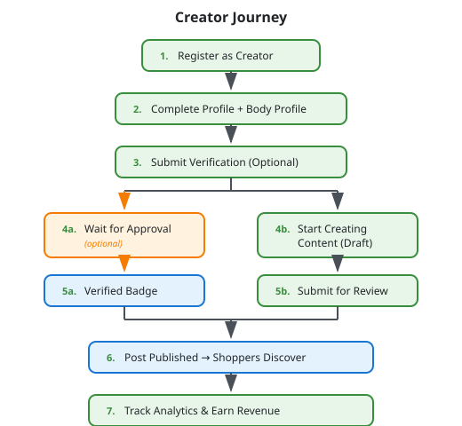
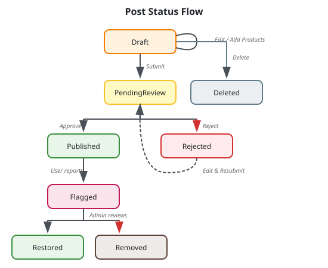
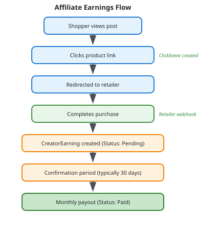

# Creator Workflows

Creators are content producers who share outfit posts featuring products from partner retailers. They earn revenue through affiliate commissions and sponsored content.

## Overview



## Registration & Profile

### Register as Creator

**Endpoint:** `POST /api/creators/v1/register`

Any authenticated user can register as a creator:

```json
{
  "displayName": "StyleByJane",
  "bio": "Fashion enthusiast sharing everyday outfit inspiration",
  "socialLinks": {
    "instagram": "@stylebyjane",
    "tiktok": "@stylebyjane"
  }
}
```

**Response:**
```json
{
  "success": true,
  "data": {
    "id": "creator-guid",
    "userId": "user-guid",
    "displayName": "StyleByJane",
    "bio": "Fashion enthusiast sharing everyday outfit inspiration",
    "isVerified": false,
    "verificationStatus": "NotSubmitted",
    "createdAt": "2024-01-01T00:00:00Z"
  }
}
```

### Get Creator Profile

**Endpoint:** `GET /api/creators/v1/profile`

**Authorization:** CreatorOnly

### Update Creator Profile

**Endpoint:** `PUT /api/creators/v1/profile`

**Authorization:** CreatorOnly

```json
{
  "displayName": "StyleByJane",
  "bio": "Updated bio with more details...",
  "socialLinks": {
    "instagram": "@stylebyjane",
    "tiktok": "@stylebyjane",
    "youtube": "StyleByJaneChannel"
  },
  "payoutEmail": "payments@example.com"
}
```

## Verification

Verification adds credibility and may unlock additional features. It is optional for posting content.

### Verification Status Flow

**NotSubmitted → Pending → Approved** (or Rejected)

### Get Verification Status

**Endpoint:** `GET /api/creators/v1/verification`

**Authorization:** CreatorOnly

**Response:**
```json
{
  "success": true,
  "data": {
    "status": "NotSubmitted",
    "submittedAt": null,
    "reviewedAt": null,
    "rejectionReason": null
  }
}
```

### Submit Verification Request

**Endpoint:** `POST /api/creators/v1/verification`

**Authorization:** CreatorOnly

Submit identity verification documents:

```json
{
  "documentUrls": [
    "https://storage.example.com/verification/doc1.jpg",
    "https://storage.example.com/verification/doc2.jpg"
  ],
  "notes": "Government ID and proof of social media account"
}
```

**After Submission:**
- Status changes to `Pending`
- Admin reviews and approves/rejects
- If approved: `IsVerified = true`, verified badge displayed
- If rejected: `rejectionReason` provided, can resubmit

## Content Management

### Post Status Lifecycle



### Create Post

**Endpoint:** `POST /api/creators/v1/posts`

**Authorization:** CreatorOnly

```json
{
  "title": "Summer Office Look",
  "description": "Perfect outfit for those hot summer days in the office...",
  "mediaType": "Image",
  "mediaUrls": [
    "https://storage.example.com/posts/image1.jpg",
    "https://storage.example.com/posts/image2.jpg"
  ],
  "thumbnailUrls": [
    "https://storage.example.com/posts/thumb1.jpg",
    "https://storage.example.com/posts/thumb2.jpg"
  ],
  "products": [
    {
      "productId": "product-guid",
      "sizeWorn": "M",
      "fitRating": "TrueToSize",
      "fitNotes": "Perfect fit at the waist, slightly loose in shoulders",
      "stylingNotes": "Tucked into the skirt for a polished look",
      "fitTags": ["True to size", "Loose in shoulders"]
    },
    {
      "productId": "product-guid-2",
      "sizeWorn": "28",
      "fitRating": "SlightlySmall",
      "fitNotes": "Runs a bit small, size up if between sizes",
      "stylingNotes": "High-waisted, pairs well with crop tops",
      "fitTags": ["Runs small", "Tight on hips"]
    }
  ]
}
```

**Media Constraints:**
- Images: JPEG, PNG, WebP (max 5MB each)
- Videos: MP4, MOV (max 100MB)
- Thumbnails required for all media

**Post is created with status: `Draft`**

### List My Posts

**Endpoint:** `GET /api/creators/v1/posts`

**Authorization:** CreatorOnly

**Query Parameters:**
| Parameter | Type | Description |
|-----------|------|-------------|
| `status` | string | Filter by status (Draft, PendingReview, Published, etc.) |
| `page` | int | Page number |
| `pageSize` | int | Items per page |

**Response:**
```json
{
  "success": true,
  "data": [
    {
      "id": "post-guid",
      "title": "Summer Office Look",
      "status": "Draft",
      "mediaType": "Image",
      "thumbnailUrls": ["https://..."],
      "productCount": 2,
      "createdAt": "2024-01-10T10:00:00Z",
      "updatedAt": "2024-01-10T10:00:00Z"
    }
  ],
  "meta": {
    "page": 1,
    "pageSize": 20,
    "totalCount": 15
  }
}
```

### Get Post Details

**Endpoint:** `GET /api/creators/v1/posts/{id}`

**Authorization:** CreatorOnly (own posts only)

### Update Post

**Endpoint:** `PUT /api/creators/v1/posts/{id}`

**Authorization:** CreatorOnly

**Constraint:** Only `Draft` posts can be edited.

```json
{
  "title": "Updated Title",
  "description": "Updated description...",
  "products": [
    {
      "productId": "product-guid",
      "sizeWorn": "M",
      "fitRating": "TrueToSize",
      "fitNotes": "Updated fit notes",
      "stylingNotes": "Updated styling notes",
      "fitTags": ["True to size"]
    }
  ]
}
```

### Delete Post

**Endpoint:** `DELETE /api/creators/v1/posts/{id}`

**Authorization:** CreatorOnly

**Constraint:** Only `Draft` or `Rejected` posts can be deleted.

### Submit for Review

**Endpoint:** `POST /api/creators/v1/posts/{id}/submit`

**Authorization:** CreatorOnly

**Constraint:** Only `Draft` posts with at least one product can be submitted.

```json
{}
```

**Result:** Post status changes to `PendingReview`

After submission:
- Admin reviews the post
- If approved: Status → `Published`, `PublishedAt` timestamp set
- If rejected: Status → `Rejected`, `ModerationNotes` provided

### Resubmitting Rejected Posts

1. Update the post to address rejection feedback
2. Submit again for review

**Note:** Rejected posts cannot be edited directly. Create a new post or contact support.

## Analytics

### Get Performance Analytics

**Endpoint:** `GET /api/creators/v1/analytics`

**Authorization:** CreatorOnly

**Query Parameters:**
| Parameter | Type | Description |
|-----------|------|-------------|
| `startDate` | date | Start of date range |
| `endDate` | date | End of date range |
| `postId` | guid | Filter to specific post (optional) |

**Response:**
```json
{
  "success": true,
  "data": {
    "summary": {
      "totalViews": 15420,
      "totalLikes": 892,
      "totalSaves": 234,
      "totalShares": 56,
      "totalClicks": 445,
      "clickThroughRate": 2.89
    },
    "topPosts": [
      {
        "postId": "post-guid",
        "title": "Summer Office Look",
        "views": 3200,
        "likes": 180,
        "clicks": 95
      }
    ],
    "dailyMetrics": [
      {
        "date": "2024-01-15",
        "views": 520,
        "likes": 32,
        "clicks": 18
      }
    ]
  }
}
```

## Earnings

### Get Earnings Summary

**Endpoint:** `GET /api/creators/v1/earnings`

**Authorization:** CreatorOnly

**Response:**
```json
{
  "success": true,
  "data": {
    "totalEarnings": 1250.50,
    "pendingEarnings": 89.25,
    "confirmedEarnings": 150.00,
    "paidEarnings": 1011.25,
    "currency": "USD",
    "lastPayoutAt": "2024-01-01T00:00:00Z"
  }
}
```

### Get Earnings History

**Endpoint:** `GET /api/creators/v1/earnings/history`

**Authorization:** CreatorOnly

**Query Parameters:**
| Parameter | Type | Description |
|-----------|------|-------------|
| `startDate` | date | Start of date range |
| `endDate` | date | End of date range |
| `type` | string | Filter by type (Affiliate, Sponsored) |
| `status` | string | Filter by status (Pending, Confirmed, Paid) |
| `page` | int | Page number |
| `pageSize` | int | Items per page |

**Response:**
```json
{
  "success": true,
  "data": [
    {
      "id": "earning-guid",
      "type": "Affiliate",
      "status": "Paid",
      "amount": 25.50,
      "currency": "USD",
      "postId": "post-guid",
      "postTitle": "Summer Office Look",
      "retailer": "Fashion Brand",
      "createdAt": "2024-01-10T14:30:00Z",
      "confirmedAt": "2024-01-12T10:00:00Z",
      "paidAt": "2024-01-15T00:00:00Z"
    },
    {
      "id": "earning-guid-2",
      "type": "Sponsored",
      "status": "Confirmed",
      "amount": 150.00,
      "currency": "USD",
      "campaignName": "Summer Collection Launch",
      "retailer": "Fashion Brand",
      "createdAt": "2024-01-08T09:00:00Z",
      "confirmedAt": "2024-01-14T10:00:00Z",
      "paidAt": null
    }
  ],
  "meta": {
    "page": 1,
    "pageSize": 20,
    "totalCount": 45
  }
}
```

## Earning Types

### Affiliate Earnings

Earned when shoppers click product links in posts and complete purchases:



### Sponsored Earnings

Earned through retailer advertising campaigns:

- Retailers create sponsored placement campaigns
- Campaigns target specific body types or categories
- Creators matching criteria are selected
- Fixed payment upon campaign completion

## Workflow Example: Creating and Publishing a Post

```
1. Creator logs in and starts new post:
   POST /api/creators/v1/posts
   {
     "title": "Date Night Outfit",
     "description": "...",
     "mediaUrls": [...],
     "products": [...]
   }
   → Post created with status: Draft

2. Reviews and edits draft:
   PUT /api/creators/v1/posts/{id}
   → Adds more fit details, adjusts styling notes

3. Submits for review:
   POST /api/creators/v1/posts/{id}/submit
   → Status changes to: PendingReview

4. Admin reviews and approves:
   → Status changes to: Published
   → PublishedAt timestamp set

5. Post appears in shopper feeds matching creator's body profile

6. Shoppers engage and click products:
   → Creator earns affiliate commissions

7. Creator monitors performance:
   GET /api/creators/v1/analytics
   GET /api/creators/v1/earnings
```

## Best Practices for Creators

### Creating Quality Content

1. **Accurate fit information**: Be precise about sizes worn and how items fit
2. **Detailed fit notes**: Mention specific areas (shoulders, waist, length)
3. **Use fit tags**: Help shoppers filter by fit characteristics
4. **Multiple angles**: Show outfit from different perspectives
5. **Good lighting**: Ensure products are clearly visible

### Maximizing Earnings

1. **Post consistently**: Regular content keeps engagement high
2. **Engage with trends**: Feature current season products
3. **Quality over quantity**: Well-detailed posts perform better
4. **Complete body profile**: Ensures matching with right shoppers
5. **Get verified**: Verified badge increases trust and engagement
