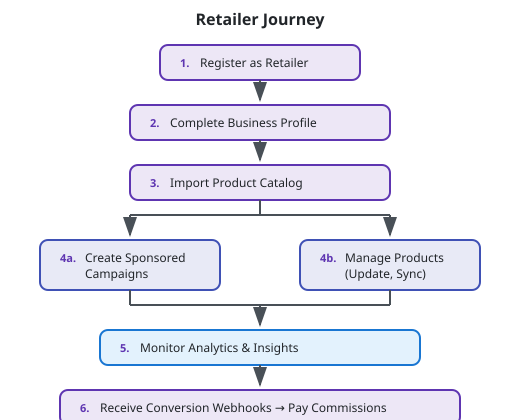

# Retailer Workflows

Retailers are B2B partners who list products on LYKE, run advertising campaigns, and access anonymized insights about how their products fit different body types.

## Overview



## Registration & Profile

### Register as Retailer

**Endpoint:** `POST /api/retailers/v1/portal/register`

```json
{
  "name": "Fashion Brand",
  "website": "https://fashionbrand.com",
  "contactEmail": "partners@fashionbrand.com",
  "contactPhone": "+1-555-0123",
  "description": "Premium fashion retailer specializing in workwear"
}
```

**Response:**
```json
{
  "success": true,
  "data": {
    "id": "retailer-guid",
    "name": "Fashion Brand",
    "website": "https://fashionbrand.com",
    "isActive": true,
    "createdAt": "2024-01-01T00:00:00Z"
  }
}
```

### Get Retailer Profile

**Endpoint:** `GET /api/retailers/v1/portal/profile`

**Authorization:** RetailerOnly

**Response:**
```json
{
  "success": true,
  "data": {
    "id": "retailer-guid",
    "name": "Fashion Brand",
    "logoUrl": "https://storage.example.com/retailers/logo.png",
    "website": "https://fashionbrand.com",
    "contactEmail": "partners@fashionbrand.com",
    "contactPhone": "+1-555-0123",
    "description": "Premium fashion retailer...",
    "affiliateConfig": {
      "commissionRate": 0.08,
      "cookieDurationDays": 30
    },
    "productCount": 1250,
    "activeCampaigns": 3,
    "isActive": true,
    "createdAt": "2024-01-01T00:00:00Z"
  }
}
```

### Update Retailer Profile

**Endpoint:** `PUT /api/retailers/v1/portal/profile`

**Authorization:** RetailerOnly

```json
{
  "name": "Fashion Brand",
  "logoUrl": "https://storage.example.com/retailers/new-logo.png",
  "website": "https://fashionbrand.com",
  "contactEmail": "newcontact@fashionbrand.com",
  "description": "Updated description..."
}
```

## Product Management

### Import Products (Bulk)

**Endpoint:** `POST /api/retailers/v1/portal/products/import`

**Authorization:** RetailerOnly

Import products from CSV file (multipart/form-data).

**CSV Format:**
```csv
ExternalSku,Name,Description,Category,SubCategory,ImageUrls,ProductUrl,Price,Currency
SKU001,Floral Maxi Dress,Beautiful summer dress...,Dresses,Maxi Dresses,"https://img1.jpg,https://img2.jpg",https://shop.com/product/001,89.99,USD
SKU002,High-Waist Jeans,Classic high-waisted...,Bottoms,Jeans,"https://img3.jpg",https://shop.com/product/002,79.99,USD
```

**Required Fields:**
- `ExternalSku` - Your internal SKU identifier
- `Name` - Product name
- `Category` - Product category
- `ProductUrl` - Link to product on your site
- `Price` - Product price

**Optional Fields:**
- `Description` - Product description
- `SubCategory` - Product sub-category
- `ImageUrls` - Comma-separated image URLs
- `Currency` - Currency code (default: USD)

**Response:**
```json
{
  "success": true,
  "data": {
    "imported": 150,
    "updated": 45,
    "failed": 3,
    "errors": [
      {
        "row": 12,
        "sku": "SKU012",
        "error": "Invalid URL format in ProductUrl"
      }
    ]
  }
}
```

### List Products

**Endpoint:** `GET /api/retailers/v1/portal/products`

**Authorization:** RetailerOnly

**Query Parameters:**
| Parameter | Type | Description |
|-----------|------|-------------|
| `category` | string | Filter by category |
| `search` | string | Search by name or SKU |
| `page` | int | Page number |
| `pageSize` | int | Items per page |

**Response:**
```json
{
  "success": true,
  "data": [
    {
      "id": "product-guid",
      "externalSku": "SKU001",
      "name": "Floral Maxi Dress",
      "category": "Dresses",
      "subCategory": "Maxi Dresses",
      "price": 89.99,
      "currency": "USD",
      "imageUrls": ["https://..."],
      "productUrl": "https://shop.com/product/001",
      "postsCount": 12,
      "clicksCount": 89,
      "lastSyncedAt": "2024-01-15T00:00:00Z"
    }
  ],
  "meta": {
    "page": 1,
    "pageSize": 20,
    "totalCount": 1250
  }
}
```

### Update Product

**Endpoint:** `PUT /api/retailers/v1/portal/products/{id}`

**Authorization:** RetailerOnly

```json
{
  "name": "Updated Product Name",
  "description": "Updated description...",
  "price": 99.99,
  "imageUrls": ["https://..."],
  "productUrl": "https://shop.com/product/001"
}
```

## Campaign Management

Sponsored placements allow retailers to promote products to targeted audiences.

### Create Campaign

**Endpoint:** `POST /api/retailers/v1/portal/campaigns`

**Authorization:** RetailerOnly

```json
{
  "name": "Summer Collection Launch",
  "budgetAmount": 5000.00,
  "targetBodyTypes": ["Hourglass", "Pear", "Rectangle"],
  "targetCategories": ["Dresses", "Tops"],
  "productId": null,
  "startDate": "2024-06-01",
  "endDate": "2024-08-31"
}
```

**Targeting Options:**

| Field | Description |
|-------|-------------|
| `targetBodyTypes` | Array of body type names to target (or null for all) |
| `targetCategories` | Array of product categories to feature |
| `productId` | Specific product to promote (or null for all matching products) |

**Response:**
```json
{
  "success": true,
  "data": {
    "id": "campaign-guid",
    "name": "Summer Collection Launch",
    "budgetAmount": 5000.00,
    "spentAmount": 0.00,
    "targetBodyTypes": ["Hourglass", "Pear", "Rectangle"],
    "targetCategories": ["Dresses", "Tops"],
    "startDate": "2024-06-01",
    "endDate": "2024-08-31",
    "status": "Active",
    "createdAt": "2024-05-15T10:00:00Z"
  }
}
```

### List Campaigns

**Endpoint:** `GET /api/retailers/v1/portal/campaigns`

**Authorization:** RetailerOnly

**Query Parameters:**
| Parameter | Type | Description |
|-----------|------|-------------|
| `status` | string | Filter by status (Active, Scheduled, Completed, Paused) |
| `page` | int | Page number |
| `pageSize` | int | Items per page |

### Update Campaign

**Endpoint:** `PUT /api/retailers/v1/portal/campaigns/{id}`

**Authorization:** RetailerOnly

```json
{
  "name": "Updated Campaign Name",
  "budgetAmount": 7500.00,
  "targetBodyTypes": ["Hourglass", "Pear"],
  "endDate": "2024-09-30"
}
```

**Note:** Some fields cannot be updated once a campaign has started spending.

## Analytics & Insights

### Engagement Analytics

**Endpoint:** `GET /api/retailers/v1/portal/analytics`

**Authorization:** RetailerOnly

**Query Parameters:**
| Parameter | Type | Description |
|-----------|------|-------------|
| `startDate` | date | Start of date range |
| `endDate` | date | End of date range |
| `productId` | guid | Filter to specific product (optional) |
| `campaignId` | guid | Filter to specific campaign (optional) |

**Response:**
```json
{
  "success": true,
  "data": {
    "summary": {
      "totalImpressions": 125000,
      "totalClicks": 4500,
      "clickThroughRate": 3.6,
      "totalConversions": 180,
      "conversionRate": 4.0,
      "totalRevenue": 12500.00,
      "currency": "USD"
    },
    "topProducts": [
      {
        "productId": "product-guid",
        "name": "Floral Maxi Dress",
        "impressions": 8500,
        "clicks": 420,
        "conversions": 28,
        "revenue": 2520.00
      }
    ],
    "dailyMetrics": [
      {
        "date": "2024-01-15",
        "impressions": 4200,
        "clicks": 168,
        "conversions": 7,
        "revenue": 630.00
      }
    ],
    "campaignPerformance": [
      {
        "campaignId": "campaign-guid",
        "name": "Summer Collection Launch",
        "impressions": 45000,
        "clicks": 1800,
        "conversions": 72,
        "spend": 2100.00,
        "roas": 5.14
      }
    ]
  }
}
```

### Export Analytics

**Endpoint:** `GET /api/retailers/v1/portal/analytics/export`

**Authorization:** RetailerOnly

**Query Parameters:**
| Parameter | Type | Description |
|-----------|------|-------------|
| `startDate` | date | Start of date range |
| `endDate` | date | End of date range |
| `format` | string | Export format (csv, xlsx) |

Returns downloadable file with detailed analytics data.

### Fit Feedback Insights

**Endpoint:** `GET /api/retailers/v1/portal/insights/fit`

**Authorization:** RetailerOnly

Aggregated fit feedback trends by product, showing how items fit different body types.

**Query Parameters:**
| Parameter | Type | Description |
|-----------|------|-------------|
| `productId` | guid | Filter to specific product (optional) |
| `category` | string | Filter by category (optional) |

**Response:**
```json
{
  "success": true,
  "data": {
    "products": [
      {
        "productId": "product-guid",
        "name": "Floral Maxi Dress",
        "category": "Dresses",
        "fitRatings": {
          "TooSmall": 5,
          "SlightlySmall": 12,
          "TrueToSize": 45,
          "SlightlyLarge": 8,
          "TooLarge": 2
        },
        "topFitTags": [
          { "tag": "True to size", "count": 38 },
          { "tag": "Long in torso", "count": 15 },
          { "tag": "Tight on hips", "count": 12 }
        ],
        "recommendation": "Consider noting 'runs slightly small' in product description"
      }
    ]
  }
}
```

### Body Profile Insights (Anonymized)

**Endpoint:** `GET /api/retailers/v1/portal/insights/body-profiles`

**Authorization:** RetailerOnly

Aggregated, anonymized insights about which body profiles engage with your products.

**Privacy Safeguards:**
- Data shown in ranges/bands, not exact measurements
- Minimum threshold required for data to be shown
- No individual user identification possible

**Response:**
```json
{
  "success": true,
  "data": {
    "engagementByBodyType": [
      {
        "bodyType": "Hourglass",
        "engagementPercentage": 28.5,
        "conversionRate": 4.2
      },
      {
        "bodyType": "Pear",
        "engagementPercentage": 22.1,
        "conversionRate": 3.8
      }
    ],
    "engagementByHeightRange": [
      {
        "range": "5'4\" - 5'6\"",
        "engagementPercentage": 35.2
      },
      {
        "range": "5'6\" - 5'8\"",
        "engagementPercentage": 28.7
      }
    ],
    "engagementByFitPreference": [
      {
        "preference": "Regular",
        "engagementPercentage": 52.3
      },
      {
        "preference": "Fitted",
        "engagementPercentage": 31.5
      }
    ],
    "topPerformingCategories": [
      {
        "category": "Dresses",
        "bodyType": "Hourglass",
        "engagementRate": 4.8
      }
    ]
  }
}
```

## Conversion Tracking

### Report Conversion Webhook

**Endpoint:** `POST /api/commerce/v1/retailers/{id}/conversions`

When a purchase is made, retailers report the conversion:

```json
{
  "clickEventId": "click-event-guid",
  "orderAmount": 89.99,
  "currency": "USD",
  "orderId": "retailer-order-12345",
  "timestamp": "2024-01-15T14:30:00Z"
}
```

**What Happens:**
1. ClickEvent is marked as converted
2. CreatorEarning is created (Status: Pending)
3. Commission calculated based on affiliate config
4. Creator can see pending earning in dashboard

**Response:**
```json
{
  "success": true,
  "data": {
    "conversionId": "conversion-guid",
    "creatorEarningId": "earning-guid",
    "commission": 7.20,
    "message": "Conversion recorded successfully"
  }
}
```

## Workflow Example: Launching a Product Campaign

```
1. Retailer imports products via CSV:
   POST /api/retailers/v1/portal/products/import
   → 500 products imported

2. Creates targeted campaign:
   POST /api/retailers/v1/portal/campaigns
   {
     "name": "Summer Dresses Promo",
     "budgetAmount": 3000.00,
     "targetBodyTypes": ["Hourglass", "Pear"],
     "targetCategories": ["Dresses"],
     "startDate": "2024-06-01",
     "endDate": "2024-06-30"
   }

3. Platform matches creators with target body profiles
   → Dresses featured more prominently in matching feeds

4. Shopper clicks product, completes purchase
   → Retailer webhook: POST /commerce/v1/retailers/{id}/conversions

5. Monitor campaign performance:
   GET /api/retailers/v1/portal/analytics?campaignId={id}
   → Track impressions, clicks, conversions, ROAS

6. Review fit insights:
   GET /api/retailers/v1/portal/insights/fit
   → "Size chart may need adjustment for petite customers"

7. Adjust future inventory/sizing based on insights
```

## Key Privacy Principles

LYKE is designed with privacy as a core principle:

| Data Type | Retailer Access |
|-----------|----------------|
| Individual user profiles | Never |
| Exact body measurements | Never |
| User identities | Never |
| Aggregated body type data | Yes (anonymized bands) |
| Fit feedback trends | Yes (product-level) |
| Engagement metrics | Yes (aggregated) |

**Minimum Thresholds:**
- Data only shown when sufficient sample size exists
- Prevents identification of individuals in small segments

**Compliance:**
- GDPR compliant
- Data used only for stated purposes
- Regular audits of data access

## Best Practices for Retailers

### Product Data Quality

1. **Complete product information**: Include all fields for best discovery
2. **High-quality images**: Multiple angles, good lighting
3. **Accurate sizing**: Correct size charts reduce returns
4. **Regular sync**: Keep inventory and pricing current

### Campaign Optimization

1. **Start with broader targeting**: Narrow based on performance data
2. **Monitor fit feedback**: Adjust products or descriptions accordingly
3. **Seasonal timing**: Align campaigns with shopping seasons
4. **A/B test**: Try different targeting combinations

### Using Insights

1. **Size chart improvements**: Use fit feedback to refine sizing
2. **Product descriptions**: Add fit notes based on creator feedback
3. **Inventory planning**: Stock sizes based on body type engagement
4. **New product development**: Design for underserved segments
