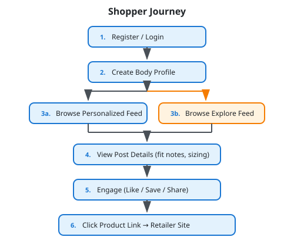

# Shopper Workflows

Shoppers are the primary consumers of LYKE. They browse outfit content from creators with similar body profiles to make confident purchasing decisions.

## Overview



## Profile Management

### Get Current Profile

**Endpoint:** `GET /api/profile/v1/me`

Returns the current user's profile information.

**Response:**
```json
{
  "success": true,
  "data": {
    "id": "user-guid",
    "email": "shopper@example.com",
    "userType": "Shopper",
    "profileImageUrl": "https://storage.example.com/profiles/user-guid.jpg",
    "hasBodyProfile": true,
    "createdAt": "2024-01-01T00:00:00Z"
  }
}
```

### Update Profile

**Endpoint:** `PUT /api/profile/v1/`

```json
{
  "displayName": "Fashion Lover"
}
```

### Upload Profile Image

**Endpoint:** `POST /api/profile/v1/me/image`

Upload a profile picture (multipart/form-data).

**Constraints:**
- Formats: JPEG, PNG, WebP
- Max size: 5MB

### Delete Profile Image

**Endpoint:** `DELETE /api/profile/v1/me/image`

## Body Profile

The body profile is essential for personalized feed matching. Without a body profile, shoppers see the general explore feed instead of personalized content.

### Create Body Profile

**Endpoint:** `POST /api/profile/v1/body`

```json
{
  "heightCm": 170,
  "weightKg": 65,
  "bodyTypeId": "guid-of-body-type",
  "fitPreference": "Regular"
}
```

**Body Types** (8 predefined):
- Hourglass
- Pear
- Apple
- Rectangle
- Inverted Triangle
- Athletic
- Petite
- Plus Size

**Fit Preferences:**
- `Fitted` - Prefers form-fitting clothes
- `Regular` - Standard fit
- `Relaxed` - Prefers loose, comfortable fits

### Get Body Profile

**Endpoint:** `GET /api/profile/v1/body`

**Response:**
```json
{
  "success": true,
  "data": {
    "id": "body-profile-guid",
    "heightCm": 170,
    "weightKg": 65,
    "bodyType": {
      "id": "guid",
      "name": "Hourglass",
      "description": "..."
    },
    "fitPreference": "Regular",
    "createdAt": "2024-01-01T00:00:00Z",
    "updatedAt": "2024-01-05T00:00:00Z"
  }
}
```

### Update Body Profile

**Endpoint:** `PUT /api/profile/v1/body`

```json
{
  "heightCm": 172,
  "weightKg": 67,
  "bodyTypeId": "guid-of-body-type",
  "fitPreference": "Fitted"
}
```

### Delete Body Profile

**Endpoint:** `DELETE /api/profile/v1/body`

Removes the body profile. The shopper will receive the general explore feed until a new profile is created.

## Feed & Discovery

### Personalized Feed

**Endpoint:** `GET /api/feed/v1/`

Returns posts from creators with similar body profiles.

**Query Parameters:**
| Parameter | Type | Description |
|-----------|------|-------------|
| `page` | int | Page number (default: 1) |
| `pageSize` | int | Items per page (default: 20, max: 50) |
| `category` | string | Filter by product category |

**Response:**
```json
{
  "success": true,
  "data": [
    {
      "id": "post-guid",
      "title": "Summer Outfit Inspo",
      "description": "Perfect for hot days...",
      "mediaType": "Image",
      "mediaUrls": ["https://..."],
      "thumbnailUrls": ["https://..."],
      "creator": {
        "id": "creator-guid",
        "displayName": "StyleByJane",
        "profileImageUrl": "https://...",
        "isVerified": true
      },
      "products": [
        {
          "id": "post-product-guid",
          "product": {
            "id": "product-guid",
            "name": "Floral Maxi Dress",
            "retailer": "Fashion Brand"
          },
          "sizeWorn": "M",
          "fitRating": "TrueToSize",
          "fitNotes": "Fits perfectly at the waist"
        }
      ],
      "engagementCounts": {
        "views": 1250,
        "likes": 89,
        "saves": 34
      },
      "publishedAt": "2024-01-10T14:00:00Z"
    }
  ],
  "meta": {
    "page": 1,
    "pageSize": 20,
    "totalCount": 150
  }
}
```

### Explore Feed

**Endpoint:** `GET /api/feed/v1/explore`

Returns trending/popular posts regardless of body profile matching.

**Query Parameters:**
| Parameter | Type | Description |
|-----------|------|-------------|
| `page` | int | Page number |
| `pageSize` | int | Items per page |
| `sortBy` | string | "trending", "recent", "popular" |

### Search

**Endpoint:** `GET /api/feed/v1/search`

Search across posts, products, and creators.

**Query Parameters:**
| Parameter | Type | Description |
|-----------|------|-------------|
| `query` | string | Search term |
| `type` | string | "posts", "products", "creators" |
| `page` | int | Page number |
| `pageSize` | int | Items per page |

### Get Post Details

**Endpoint:** `GET /api/posts/v1/{id}`

Returns full post details including all products, fit information, and engagement stats.

### Similar Posts

**Endpoint:** `GET /api/posts/v1/{id}/similar`

Returns up to 10 similar posts based on the current post's products and creator profile.

## Engagement

### Record Engagement

**Endpoint:** `POST /api/posts/v1/{id}/engage`

```json
{
  "type": "Like"
}
```

**Engagement Types:**
- `View` - Recorded automatically when post is viewed
- `Like` - User likes the post
- `Save` - User saves post to collection
- `Share` - User shares the post

### Remove Engagement

**Endpoint:** `DELETE /api/posts/v1/{id}/engage`

```json
{
  "type": "Like"
}
```

Removes a like or save from a post.

### Get Saved Posts

**Endpoint:** `GET /api/posts/v1/saved`

Returns all posts the user has saved.

**Query Parameters:**
| Parameter | Type | Description |
|-----------|------|-------------|
| `page` | int | Page number |
| `pageSize` | int | Items per page |

### Report Content

**Endpoint:** `POST /api/posts/v1/{id}/report`

Report inappropriate or problematic content.

```json
{
  "reason": "InappropriateContent",
  "additionalDetails": "The post contains..."
}
```

**Report Reasons:**
- `InappropriateContent`
- `MistaggedProducts`
- `Fraud`
- `Other`

## Commerce

### Track Product Click

**Endpoint:** `POST /api/commerce/v1/clicks/track`

When a shopper clicks on a product link, this endpoint records the click and returns the affiliate URL.

```json
{
  "postId": "post-guid",
  "postProductId": "post-product-guid"
}
```

**Response:**
```json
{
  "success": true,
  "data": {
    "clickId": "click-event-guid",
    "affiliateUrl": "https://retailer.com/product?ref=lyke&click=guid",
    "trackedAt": "2024-01-15T10:30:00Z"
  }
}
```

### Get Product Details

**Endpoint:** `GET /api/commerce/v1/products/{id}`

**Response:**
```json
{
  "success": true,
  "data": {
    "id": "product-guid",
    "name": "Floral Maxi Dress",
    "description": "Beautiful summer dress...",
    "category": "Dresses",
    "subCategory": "Maxi Dresses",
    "imageUrls": ["https://..."],
    "productUrl": "https://retailer.com/product",
    "price": 89.99,
    "currency": "USD",
    "retailer": {
      "id": "retailer-guid",
      "name": "Fashion Brand",
      "logoUrl": "https://..."
    }
  }
}
```

### Get Posts for Product

**Endpoint:** `GET /api/commerce/v1/products/{id}/posts`

See all posts featuring a specific product with fit feedback from different creators.

### Browse Retailers

**Endpoint:** `GET /api/commerce/v1/retailers/`

List all active retailers on the platform.

### Browse Retailer Products

**Endpoint:** `GET /api/commerce/v1/retailers/{id}/products`

**Query Parameters:**
| Parameter | Type | Description |
|-----------|------|-------------|
| `category` | string | Filter by category |
| `page` | int | Page number |
| `pageSize` | int | Items per page |

## Lookups

Public endpoints for reference data:

### Body Types

**Endpoint:** `GET /api/lookup/v1/body-types`

### Fit Preferences

**Endpoint:** `GET /api/lookup/v1/fit-preferences`

### Fit Tags

**Endpoint:** `GET /api/lookup/v1/fit-tags`

Returns available fit tags like "Tight on hips", "Long in arms", "True to size", etc.

## Workflow Example: Finding the Perfect Dress

```
1. Shopper logs in and has body profile:
   Height: 165cm, Weight: 60kg, Body Type: Hourglass, Fit: Regular

2. Opens personalized feed:
   GET /api/feed/v1/
   → Receives posts from creators with similar measurements

3. Sees a dress they like, views post details:
   GET /api/posts/v1/{post-id}
   → Creator is 167cm, 62kg, same body type
   → Size worn: S, Fit rating: SlightlySmall
   → Fit notes: "Snug around hips, went up to M for comfort"

4. Saves the post for later:
   POST /api/posts/v1/{post-id}/engage
   { "type": "Save" }

5. Clicks to buy the dress:
   POST /api/commerce/v1/clicks/track
   { "postId": "...", "postProductId": "..." }
   → Redirected to retailer with affiliate link
   → Creator earns commission if purchase is made
```
